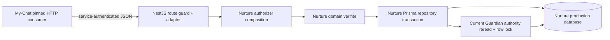

# NestJS Ingress M3 Baseline Inventory

## Status

- Task: T-002
- Captured: 2026-07-31
- Decision:
  `M3_BASELINE_COMPLETE / M3_IMPLEMENTATION_OPEN / OWNER_INTEGRATION_NO_GO`
- Closure disposition (2026-07-31):
  `M3_A_COMPLETE / M3_B_COMPLETE / M3_C_COMPLETE /
  OWNER_INTEGRATION_NO_GO`. This supersedes only the implementation-open part
  of the captured baseline; M4 governance alignment, M5 handoff regeneration
  and Joint Conformance remain separate gates.
- Scope: freeze the existing P7 HTTP/application behavior, composition boundary,
  persistence evidence and test gaps before moving the binding-owner endpoint
  from the provisional Fastify dev-host to the formal NestJS scenario service.
- Non-effect: this inventory changes no source, package, schema, migration,
  database, environment value, secret, capability, deployment, activation or
  traffic.

## Purpose and use

Use this record as the implementation input for M3-A through M3-C in
[`12-nestjs-ingress-migration-plan.md`](./12-nestjs-ingress-migration-plan.md).
It answers four questions:

1. Which current P7 behavior is a wire/application contract?
2. Which behavior belongs to the provisional Fastify parser and must not be
   copied into the formal service?
3. Which production composition and build seams are missing?
4. Which evidence must be added before M3 can qualify?

This is not an Owner Integration Handoff. My-Chat revision
`f00b86861cf0b751d747c7e0bc5cb86a952900de` remains the exact consumer input;
the current sibling checkout is observation material only.

## Baseline sources

The inventory used the following source-of-truth layers:

- Workflow boundary:
  `docs/context/workflow/nurture-scenario-contract.md`,
  `packages/nurture-scenario/scenario.manifest.yaml`, and
  `packages/nurture-scenario/src/module.ts`.
- Current P7 ingress and composition:
  `apps/backend/src/binding-owner.ts`,
  `apps/backend/src/app.ts`, and
  `apps/backend/tests/p7-binding-owner.e2e.test.ts`.
- Nurture domain/persistence:
  `packages/nurture-scenario/src/domain/identity/scenario-binding-owner.ts`,
  `packages/nurture-db/src/repositories/scenario-binding-owner.repository.ts`,
  the production Prisma schema, and the matching unit/integration tests.
- Formal ingress:
  `apps/scenario-service/src/application.ts`,
  `apps/scenario-service/src/binding-owner-service-auth.guard.ts`,
  `apps/scenario-service/src/binding-owner-disabled.controller.ts`, and
  `apps/scenario-service/src/safe-exception.filter.ts`.
- Exact Host consumer:
  My-Chat `f00b868...` files
  `packages/scenario-integrations/src/nurture-binding-owner.ts` and its tests,
  read from the pinned Git revision rather than from the floating worktree.

## Frozen ownership and composition boundary



- My-Chat owns authenticated principal, canonical Child/Family identity and the
  Host consumer. It receives only the Nurture receipt; it does not query the
  Nurture database.
- Nurture owns the route contract, opaque typed anchor, current business
  authority reread, authorization receipt and production persistence.
- The formal scenario service may use only the Nurture production Prisma
  client. It must not start the dev-host Prisma stream or import the My-Chat
  ORM/runtime.
- `child_id`, `family_id`, scenario binding and routing context are inputs to
  policy, never authorization by themselves.
- Anchor reservation and receipt issuance remain in the existing
  domain/repository path. M3 must not reimplement them in the controller.

## Frozen HTTP/application contract

Method and path remain:

```text
POST /internal/nurture/scenario-binding/authorize
```

The state order is fixed:

1. Missing authorizer composition or service token:
   `503 {"error":"binding_owner_disabled"}`.
2. Enabled route with missing/invalid strict bearer:
   `401 {"error":"service_auth_required"}`.
3. Authenticated request: apply the P7 request adapter, then call the authorizer.

### Request field matrix

| Wire field | Required | Current HTTP rule | Domain rule / note |
| --- | --- | --- | --- |
| `workspace_id` | yes | non-empty string, at most 512 code units | exact, trimmed text, at most 128 |
| `acting_user_id` | yes | non-empty string, at most 512 | exact, trimmed text, at most 128 |
| `idempotency_key` | yes | non-empty string, at most 512 | exact, trimmed text, at most 512 |
| `subject_type` | yes | literal `child` or `family` | same enum |
| `subject_id` | yes | non-empty string, at most 512 | exact, trimmed text, at most 128; opaque platform identifier |
| `scenario_key` | yes | literal `nurture` | same literal |
| `acting_actor_id` | yes | non-empty string, at most 512 | exact, trimmed text, at most 128 |
| `represented_organization_id` | no | when present, non-empty string, at most 512 | exact, trimmed text, at most 128 |
| `purpose` | yes | literal `scenario_binding_write` | same literal |
| `correlation_id` | no | current route forwards only a truthy value | if forwarded, exact trimmed text, at most 128 |
| `trace_id` | no | current route forwards only a truthy value | if forwarded, exact trimmed text, at most 128 |

The existing two-layer behavior is intentional baseline, not an endorsement:

- HTTP validation is wider than domain validation for several identifiers.
  Values such as surrounding whitespace or 129–512 character identifiers reach
  the authorizer and are rejected there as `invalid_binding_request`.
- Unknown top-level request fields are ignored by the current HTTP adapter
  because it reconstructs the domain input from an allowlisted field set.
  M3 must preserve this behavior or introduce a separately approved contract
  version; DTO defaults must not accidentally change it.
- `correlation_id` and `trace_id` are diagnostic inputs and are not included in
  the persisted request fingerprint. M3 does not expand that established
  idempotency identity.

### Success response

The `200` body is the following allowlisted shape:

| Field | Rule |
| --- | --- |
| `status` | literal `authorized` |
| `authorization_ref` | receipt identifier |
| `workspace_id` | exact request workspace |
| `subject_type` | exact `child` or `family` |
| `subject_id` | exact opaque request subject |
| `scenario_key` | literal `nurture` |
| `owner_ref` | canonical typed Nurture anchor reference |
| `owner_version` | positive safe integer |
| `authorized_actor_id` | exact request actor |
| `represented_organization_id` | emitted only when present on the receipt |
| `purpose` | literal `scenario_binding_write` |
| `verified_at`, `expires_at` | ISO-8601 timestamps |

The pinned My-Chat consumer rejects foreign response fields and identity drift.
The Nest controller therefore must construct this shape explicitly rather than
serializing a domain or Prisma object.

### Error mapping

| Condition / domain code | HTTP | Body |
| --- | ---: | --- |
| authorizer or token absent | 503 | `{"error":"binding_owner_disabled"}` |
| strict bearer invalid | 401 | `{"error":"service_auth_required"}` |
| `invalid_binding_request` | 400 | `{"error":"invalid_binding_request"}` |
| `invalid_owner_ref` | 400 | `{"error":"invalid_owner_ref"}` |
| `anchor_not_found` | 409 | `{"error":"anchor_not_found"}` |
| `anchor_not_current` | 409 | `{"error":"anchor_not_current"}` |
| `authorization_replay_conflict` | 409 | `{"error":"authorization_replay_conflict"}` |
| `authorization_receipt_inactive` | 409 | `{"error":"authorization_receipt_inactive"}` |
| `owner_authorization_denied` | 403 | `{"error":"owner_authorization_denied"}` |
| `owner_authorization_unavailable` | 503 | `{"error":"owner_authorization_unavailable"}` |
| unexpected authorizer exception | 500 | `{"error":"owner_authorization_unavailable"}` |

`ERROR_STATUS` must have one Nurture-owned implementation used by both ingress
adapters during migration. Unknown exceptions remain body-safe and observable;
their message, stack and request body must not be returned or logged.

## Parser parity boundary

Literal “all negative responses are field-identical to Fastify” conflicts with
the already accepted M1 security boundary:

| Probe | Fastify dev-host | Formal NestJS M1/M2 |
| --- | --- | --- |
| malformed JSON | framework-specific `400` body containing `FST_ERR_CTP_INVALID_JSON_BODY` and parser message | body-safe `400 {"error":"invalid_request"}` |
| JSON `null` | P7 adapter `400 {"error":"invalid_binding_request"}` | body parser rejects with `400 {"error":"invalid_request"}` |
| `text/plain` | P7 adapter reaches an empty body and returns `invalid_binding_request` | JSON-only formal shell does not parse it; the current disabled stub cannot freeze the final adapter result, so M3-B must cover it |
| payload over 64 KiB | no M3 contract established | fixed M1 `413 {"error":"payload_too_large"}` |
| handler timeout | no P7 wire contract | fixed M1 `408 {"error":"request_timeout"}` |

M3 acceptance is therefore split into two non-overlapping bands:

- **P7 application parity:** authenticated requests that reach the route
  adapter, all frozen field validation, all domain errors, unexpected
  authorizer failure and the success receipt are status/error/body equivalent.
  This includes the existing `text/plain` empty-body outcome.
- **Formal shell safety:** malformed JSON, payload limit, timeout, unknown route
  and any other failure produced before the P7 adapter continue using the M1
  safe error contract. Fastify framework names/messages are not migration
  inputs.

This clarification changes no Host-consumed P7 behavior: the pinned My-Chat
client always sends a JSON object and treats non-2xx responses as bounded
deny/unavailable results.

## Persistence and authority baseline

- Anchor reservation uses a keyed digest of exact
  `workspace + subject_type + subject_id` identity and persists no raw platform
  subject.
- The repository locks the anchor, rereads Guardian authority inside the same
  transaction, checks current evidence, and writes/replays the receipt before
  commit.
- Receipt lifetime is five minutes. HMAC evidence construction requires at
  least 32 UTF-8 bytes.
- Exact replay returns the committed receipt; same idempotency identity with a
  different semantic request returns `authorization_replay_conflict`.
- Revoked/retired/quarantined anchors and inactive/expired receipts fail
  closed.
- The current Guardian SQL looks up an active participant and active Guardian
  role in the workspace, locks the selected role row, and records that
  role/version as authority evidence.

The SQL currently omits explicit `deleted_at IS NULL` predicates even though
the active uniqueness indexes include them. M3-C must add regression coverage
and close this mismatch in the shared reader before Owner Integration
qualification. Subject-specific Guardian scope remains an explicitly deferred
G1-03 gap; M3 must neither invent that chain nor claim the workspace-level P7
check satisfies it.

## Test evidence census

| Layer | Existing evidence | Baseline result | Missing for M3 |
| --- | --- | --- | --- |
| Domain verifier | 6 focused tests | PASS | full error-map adapter fixtures |
| Repository fake | 9 focused tests | PASS | none for current fake semantics |
| Production PostgreSQL repository | real issue/replay and authority-lock/concurrent-revoke tests | SOURCE PRESENT; local rerun blocked because Docker daemon is unavailable | rerun on disposable PostgreSQL |
| Fastify P7 HTTP | 2 journey tests | SOURCE PRESENT | child/family matrix, every error code, unexpected exception, complete request validation |
| NestJS M2 | 5 files / 25 tests | PASS | real controller/authorizer path and parity runner |
| Pinned My-Chat consumer | 5 source tests at exact `f00b868...` | SOURCE REVIEW PASS | run exact client against NestJS in M3-C |
| CI | scenario-service type/test/build/smoke; separate DB/dev-host jobs | PASS for current M2 topology | exact source checkout, production Prisma generation and disposable-PG Nest target |

## Prioritized findings and required disposition

### Must close before M3 acceptance

1. **M3-BLD-01 — no compiled runtime seam.** Both
   `@the-nurture/scenario` and `@the-nurture/db` export `./src/index.ts` and
   have no build output contract, while the formal service starts
   `dist/main.js`. Directly importing those workspace packages would couple
   the production process to TypeScript source and can break both `rootDir`
   compilation and Node runtime resolution. M3-A must establish and verify an
   explicit compiled-package or bundling boundary before controller work.
2. **M3-PAR-02 — parity scope was ambiguous.** Framework parser errors cannot
   be byte-copied without regressing the M1 safe-error decision. The two-band
   acceptance above is now authoritative for M3.
3. **M3-CMP-03 — authorizer availability can drift.** M2 passes an independent
   `bindingOwnerAuthorizerAvailable` boolean into the guard. M3 must inject the
   actual optional authorizer object and derive both guard readiness and
   controller execution from the same immutable composition.
4. **M3-TST-04 — the HTTP negative matrix is incomplete.** The current two
   Fastify journeys do not freeze every error, request-field edge, family
   response, unexpected exception or parser boundary. M3-B must add
   table-driven black-box fixtures before replacing the stub.
5. **M3-CI-05 — formal CI has no owner persistence lane.** The current
   scenario-service job does not materialize exact My-Chat source, generate the
   production Prisma client or start PostgreSQL. M3-C must add an isolated,
   disposable database path and run the Nest target with exact pins.

### Should close in the M3 implementation

1. **M3-ARC-06 — composition is owned by the dev host.**
   `createGuardianRoleAuthorityReader` and
   `createScenarioBindingOwnerAuthorizer` must move to a Nurture-owned shared
   composition/data boundary. Fastify may temporarily import it for parity;
   the formal service must not import `apps/backend`.
2. **M3-AUT-07 — soft-delete predicates are implicit.** Add
   `deleted_at IS NULL` to the participant/role current-authority reads with
   regression tests. Keep the established workspace-Guardian semantics and
   the subject-scope gap explicit rather than silently broadening authority.
3. **M3-VAL-08 — DTO defaults can cause wire drift.** Do not enable implicit
   coercion, trimming, unknown-field rejection or blanket class-validator
   limits. Implement the frozen P7 adapter deliberately, then rely on the
   existing stricter domain validation.
4. **M3-CFG-09 — enablement must stay fail-closed.** Token presence alone
   cannot enable P7. Missing or invalid evidence-key composition leaves the
   authorizer absent; evidence-key material is never logged or serialized.

### May defer

- Consolidate the duplicated Fastify/Nest bearer implementation only when M5
  removes or hard-disables the dev-host route.
- Promote a generic owner-invocation SPI only if another scenario needs one;
  ING-D7 remains a future note, not M3 scope.
- Add nonce/expiry/canonical-request authentication only through a separately
  versioned G1-03 slice.

## M3 implementation slices

### M3-A — build and composition seam

- Establish a runtime-safe shared package/export boundary.
- Move the authorizer factory and Guardian reader out of `apps/backend`.
- Compose one optional authorizer from the production Prisma client and
  evidence key; derive guard readiness from that object.
- Prove typecheck, build, built-process startup/shutdown and default-disabled
  behavior before adding a live controller.

Exit: the compiled NestJS process can load the shared composition without
TypeScript-source runtime imports, dev-host Prisma, My-Chat ORM/runtime or
secret leakage.

### M3-B — controller and parity fixtures

- Replace the disabled stub with the allowlisted P7 request/response adapter.
- Centralize the domain error/status map and safe unexpected-error translation.
- Run the same table-driven application fixtures against Fastify and NestJS.
- Keep M1 parser, size, timeout and logging safety fixtures as a separate band.

Exit: every P7 application fixture is status/error/body equivalent and every
formal-shell fixture retains its M1 safe response.

### M3-C — real persistence and exact consumer

- Use disposable PostgreSQL and production migrations only.
- Exercise child and family authorization, exact replay, divergent replay,
  response-loss recovery, revoke, inactive receipt, stale/missing anchor,
  authority loss and concurrent revoke through NestJS.
- Execute the exact `f00b868...` My-Chat HTTP source against the formal ingress.
- Add CI evidence with exact revisions, Prisma generation, test counts and
  sanitized diagnostics.

Exit: transaction/replay/revoke/privacy evidence is renewed through NestJS and
M3 can be marked complete. Owner Integration and Joint Conformance remain
separate later gates.

## Baseline verification

| Check | Result |
| --- | --- |
| Domain binding-owner focused tests | PASS — 6/6 |
| Fake repository binding-owner focused tests | PASS — 9/9 |
| Scenario-service M2 tests | PASS — 5 files / 25 tests |
| Persistence-boundary verification | PASS |
| N1 schema-contract verification | PASS |
| Project-governance lint | PASS |
| Read-only Fastify/Nest parser probes | PASS — differences recorded above |
| Disposable PostgreSQL rerun | NOT RUN — local Docker daemon unavailable |

At baseline capture, no persistent database or sibling repository was
modified. The Docker limitation was not treated as a waiver: M3-C remained
blocked until the disposable-PostgreSQL evidence recorded below succeeded.

## M3 closure disposition (2026-07-31)

| Baseline finding | Disposition |
| --- | --- |
| `M3-BLD-01` compiled runtime seam | CLOSED — narrow compiled scenario/DB subpaths are built before service typecheck/test/build/start. |
| `M3-PAR-02` parity ambiguity | CLOSED — 22 shared Fastify/Nest application cases plus separate formal-shell parser safety. |
| `M3-CMP-03` readiness drift | CLOSED — guard/controller share one actual optional `BindingOwnerRuntime`. |
| `M3-TST-04` negative matrix | CLOSED — 42 scenario-service tests and complete domain/application error coverage. |
| `M3-CI-05` persistence lane | CLOSED — exact dependency checkouts, Prisma generation, DB typecheck/test and sanitized artifacts in CI. |
| `M3-ARC-06` dev-host composition | CLOSED — composition is owned by `@the-nurture/db/binding-owner`. |
| `M3-AUT-07` implicit current-row rules | CLOSED — soft-delete/effective-window checks, UTC-safe time comparison and participant/role locks have real PostgreSQL coverage. |
| `M3-VAL-08` DTO drift | CLOSED — explicit shared allowlist adapter; no implicit coercion/trimming/unknown rejection. |
| `M3-CFG-09` fail-closed enablement | CLOSED — incomplete token/evidence/database configuration creates no authorizer or Prisma connection. |

Local PostgreSQL on a unique empty database replaced the unavailable Docker
daemon and was deleted after each run. The exact external pin verifier passed
against detached worktrees at Base `5c04dce...` and My-Chat `f00b868...`; no
sibling tracked file was changed. The Nurture self-pin expands to 40 paths / 53
files at `0c031f99...5242c4` at M3-C close. The later quality audit additionally
made reservation/receipt persistence one owner transaction, added explicit
non-UTC regression evidence and removed stale build outputs; its renewed
self-pin is recorded in the current overview and verification ledger. M3 is
complete, but this record is still not an Owner Integration Handoff,
deployment, activation or traffic authority.
