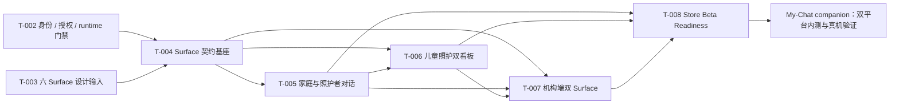

# Roadmap — 六个核心 Surface 到双平台内测

## Goal

用 5 个 The Nurture 任务包把 T-003 设计输入转化为可由 My-Chat 通过版本化接口精确集成、并在 TestFlight Internal、Google Play Internal 上多真机验证的 Nurture 服务候选。

## Planning Mode

- Runtime mode: Default（non-Plan）
- Host plan artifact: none
- Planning source: 本任务的 `requirement.md` 与本路线图

## Locked Top-level Decisions

- 2026-07-29 / Task nature：T-004 是可执行契约基座，不是纯设计文档，也不提前实现六个 surface 的完整业务。
- 2026-07-29 / Contract organization：采用“语义发现平面 + 确定性执行平面”；queries/commands 按 capability 组织，presenters 按 surface 组织。
- 2026-07-29 / LLM runtime scope：T-004 只做到 engine-ready。跨 Scenario 共享引擎不进入 Nurture 当前关键路径；Nurture 不直接调用模型 provider。
- 2026-07-29 / Surface output：当前先按 Nurture 节奏验证 semantic UI contract；输出采用 atomic surface envelope，并分为 Conversation timeline、Board semantic modules、Workbench Hub/List/Insight。Nurture owns what/meaning/order；My-Chat 后续 owns terminal rendering，不建设通用 server-driven UI。
- 2026-07-29 / Golden journeys：不设唯一主线。使用 GJ-1 至 GJ-5 五条代表性产品 Journey 加 RJ-1 一条跨域韧性 Journey；共享版本化 synthetic world、独立运行，并分别证明产品闭环和最高风险拒绝路径。
- 2026-07-29 / Identity baseline：六个正式 surface 不纳入 product-visible provisional child；开发使用 synthetic bound fixtures，真实采用必须由家长授权建立 My-Chat Child/Family binding。身份、Family/Guardian、Enrollment/CareGroup、Grant 是独立轴，不压缩为单一生命周期枚举。
- 2026-07-29 / Multi-institution and grant：一个 ChildCareProcess 可有多个彼此隔离的 Institution Enrollment；Grant 按 Enrollment 与 `data class × direction` 生效。机构只能发送 GrantRequest，Guardian 明确确认后才产生 Grant，且不跨 Enrollment 继承。
- 2026-07-29 / Chat and board：Guardian Chat 负责 child-centered、跨当前授权来源的反馈与总结，Nurture 先过滤和聚合，LLM 不选择机构 API；开放式跨机构写入默认在家庭看板选择 Enrollment。Chat 仅处理服务端已绑定目标的动作卡或试点唯一目标的确定性动作。
- 2026-07-29 / T-002 parallelism：采用 contract-first parallel development + activation fence。T-004 可用 synthetic owner fixtures 完成诚实的 contract qualification；真实 owner adapter/persistence/public path 等待精确 T-002 contract，T-008 candidate freeze 等待所需 qualification pins，不实现 fallback。
- 2026-07-29 / Service/API boundary（supersedes Candidate adoption wording）：Nurture 独立拥有不可变 Service Candidate；My-Chat 不采用 Nurture 代码或 bundle，而是通过认证接口消费 versioned contract。真机证据以 composite binding 精确关联 My-Chat build、Nurture Candidate、contract digest 与测试环境；exact binding 不自动授予 activation/traffic。
- 2026-07-29 / Identity ownership split：T-004 只锁定 interface contract identity/compatibility；T-008 拥有 Service Candidate identity/digest 和 release qualification；T-008 + My-Chat companion 拥有 composite validation binding。发布 ID 格式不阻塞 T-004～T-007。
- 2026-07-29 / T-005 communication model：不建设跨角色共享聊天室。Guardian Chat 是 family-private child-centered synthesis/feedback；Caregiver Chat 是 authorized work/item projection。跨边界由 Nurture Message/CareItem/Event/Receipt 链连接，My-Chat Chat transcript 不承载业务真相或授权；每条链绑定精确 Enrollment 与原始 Grant。
- 2026-07-29 / T-005 entry and Harness model：区分 ordinary chat、Chat-assisted action、board-direct action。普通 Chat 默认无业务副作用；Chat 与看板的业务动作调用同一 Nurture Capability Harness。Chat 只增加 semantic candidate 形成步骤，看板可直接提供 typed input；二者共享 deterministic authority/confirmation/execution/result contract。CareItem 只是对应已确认 capability 的领域结果。
- 2026-07-29 / Harness contract and runtime reuse：Harness 使用通用 envelope + capability-specific typed schemas，分为 `query/readResult` 与 `prepareAction/executeAction` 两个 lane。preview/confirmation 不创建 Workflow；family-care `ActionExecution` 复用 Nurture CommandExecution，宿主投递使用 My-Chat `ActionDelivery`。T-004 拥有通用 invocation/compatibility，T-005 拥有 family-care specs/effects。
- 2026-07-29 / PrepareAction confirmation：prepare 不做 capability discovery、不持久化 draft；trusted/user/server-resolved inputs 分层。ready 返回五分钟、opaque/body-free、不可延长/复活、不跨主体/设备/surface、对新 effect 单次消费的 `confirmationRef`。execute 在同一 surface 重交 typed input 并校验 hash；响应丢失使用相同 command request exact replay。
- 2026-07-29 / ExecuteAction and Increment 1：My-Chat owns per-call invocation identity；Nurture prepare owns stable business command identity。原子 action 同事务消费 confirmation、reread authority/version、写 effect/receipt 与 CommandExecution。结果分 `committed | not_committed | outcome_unknown`，并正交表达 executed/replayed 与 applied/already-satisfied。首增量仅 `submit → acknowledge → reply`；correction/redaction/revoke 后置。
- 2026-07-29 / Confirmation UX：每个 business effect 默认只需一次结构化、effect-labeled 手势。submit/reply 在 Chat card 或 board form/composer 中先展示准确内容、目标和效果，再以一个 CTA commit；acknowledge 一次 gesture。prepare/execute 对用户透明，不增加通用确认弹窗；自然语言不能单独确认。
- 2026-07-29 / CareGroup shared responsibility and multi-reply（supersedes exclusive claimant/single reply）：CareItem 由原始精确 `Enrollment + CareGroup` 共同承接；acknowledge 表示班级已收到。班级是家庭侧业务发送主体，个人保留执行审计/可选次级署名。同班任一当前合格照护者可追加多条回复；第一条解除待回复 Attention，但不关闭事项。跨班级、同园区或仅同角色不授权。
- 2026-07-29 / Input and concurrency precondition：capability-specific typed input 只包含业务字段；acknowledge input 为空，reply input 只含受保护正文。CareItem target/concurrency heads、actor/scope 与 command identity 属于 generic Harness。acknowledge 使用 exact-state version；reply 使用 append-compatible lifecycle/authority heads，另一合法回复不构成 stale。precondition 与 idempotency identity 分别处理动作安全和 exact replay。
- 2026-07-29 / CareItem continuation：Increment 1 的 CareItem 在 reply 后 terminal，继续交流创建新 Item。可选 `contextContinuationOfItemRef` 只表达同一 ChildCareProcess/Enrollment 内的展示与总结上下文，不继承 Grant/authority/owner/SLA/state/command identity，也不触发 dependency；未来使用独立 `CareItemDependency`。
- 2026-07-29 / Submit v1 input：只开放 1–2000 字符受保护纯文本 family-care question 与可选 context continuation。多目标通过 owner-issued prepare target 选择；分类、urgency、direction、ack/reply、Grant、route、safe summary 和 command identity 由 Nurture 推导。普通 Chat 只传 intent，不复制或让 LLM 处理 protected body；附件、富文本、AI protected draft 和医疗/紧急写入后置。
- 2026-07-29 / Workflow terminology（supersedes broad/claimed-Step wording）：当前产品 Workflow 只指园区管理 `InstitutionWorkflow`。Web workbench 是主要操作面；Institution mobile board 及其他 boards 只消费 role-safe `InstitutionWorkflowProjection`。family-care 使用 `CareInteraction`/`ActionExecution`/`ActionDelivery`，two-stage publish 使用 `PublishProcess`；异步、跨 owner、worker、Handoff 或通知不构成 Workflow。

## Task Map

## Milestone 0 — Discovery and Gate Check

Owner task: T-004

- 对齐 T-002/T-003、workflow/product/DB context、manifest/module 与现有实现。
- 建立 capability/gate/delta 清单，并把每项标为 contract-parallel、owner-integration-gated 或 activation-gated。
- 任何 T-002 blocker 保留原状态；本路线图不授权外部流量。

Exit:

- 六 surface 的来源、所有权、依赖和禁止项可追溯。
- 可以区分“设计已决定”“Nurture 已实现/部署”“My-Chat 待接口集成”。

## Milestone 1 — Contract Foundation

Owner task: T-004

- 固定 actor/role/workspace/visibility matrix。
- 固定 capability-first queries/commands 与 surface-first presenters。
- 发布 machine-readable capability descriptors、typed schemas、eligibility policy references、confirmation/side-effect metadata 与选择 fixtures。
- 固定 atomic surface envelope 与三类 semantic content families；允许当前项目提供参考呈现/检验工具，但不创建独立产品 shell。
- 保持共享引擎为外部后续能力；当前仅保证 catalog 可被未来通用 discovery/invocation protocol 消费。
- 固定 bound Family、多个隔离 Enrollment、per-Enrollment GrantRequest/Grant 与 revoked/stale fail-closed 的身份就绪矩阵；正式 surface 不依赖 product-visible provisional child。
- 固定 Guardian Chat 的跨授权来源聚合查询与家庭看板的目标化命令边界；多 Enrollment 写入不得由 LLM 静默路由。
- 固定 interface contract identity、version/digest 语义与兼容规则，但不在 T-004 设计 Service Candidate identifier。
- 建立共享版本化 synthetic world，以及独立运行的 GJ-1 家庭→照护者、GJ-2 照护者→家庭、GJ-3 成长连续性、GJ-4 关系/授权建立、GJ-5 机构支持和 RJ-1 撤权/恢复旅程。

Exit:

- 后续任务使用同一 contract/fixture 基线。
- My-Chat 不需要 ORM 或数据库访问。
- 后续共享引擎无需改写 Nurture 业务 commands 即可接入，但其实现不阻塞本里程碑。
- My-Chat 后续只需把已验证 semantic contract 映射到 native/web components，而不重新解释业务事实和权限。
- 单机构试点可使用唯一目标的确定性简化，但 contract 不固化“一名孩子只有一个 Institution Enrollment”的假设。
- T-004 contract qualification 可以在 T-002 runtime 未完成时通过，但必须明确列出未实现的 owner path、所需 pin 和 activation NO-GO。
- Journey Portfolio 覆盖六个 surface；exhaustive role/action combinations 仍由 conformance matrix 负责，不把单条 Journey 扩张成不可维护的全排列。

## Milestone 2 — Product Capabilities

Owner tasks: T-005, T-006, T-007

- T-005：Guardian/Caregiver Chat 的双角色投影，以及 Nurture-owned care item/message/receipt semantics；不含共享聊天室。
- T-006：Guardian/Caregiver boards、capture 和 two-stage publish。
- T-007：Institution mobile read-only board 的 `InstitutionWorkflowProjection` 与 Web
  workbench 的 `InstitutionWorkflow` 操作。

执行关系：

- T-005 在 T-004 基线后开始。
- T-006 可与 T-005 部分并行，但发布/回执集成需消费 T-005 已稳定语义。
- T-007 可先做 product questions 与 aggregate policy，最终资格验证依赖 T-005/T-006。

Exit:

- 六 surface 的 Nurture-side capabilities 通过公共契约黑盒测试。
- 无身份复制、私域泄漏、排名或诊断行为。
- Workflow/Action/Delivery/Projection/PublishProcess 术语在所有 consumer contract 中一致。

## Milestone 3 — Candidate Freeze and Qualification

Owner task: T-008

- 冻结精确 source revision、依赖 pins 和 contract versions。
- 定义并冻结 Nurture Service Candidate identity/digest；消费 T-004 已发布的 interface contract identity。
- 生成单一不可变 Nurture Service Candidate bundle；Nurture 部署、资格证据和回滚引用 exact Candidate identity，My-Chat 仅消费其 versioned interface contract。
- 验证 manifest、public API、presenters、DB/migration compatibility、fixtures。
- 跑完整六 surface acceptance journey、权限负例和 fail-closed 检查。
- 形成 interface compatibility matrix、integration checklist、rollback 和证据索引。

Exit:

- 一个 immutable、undeployed、default-off 且具备精确 release identity 的 Nurture Service Candidate，以及可供 My-Chat 接口集成的 contract handoff 可进入 companion validation。
- 任何未满足 blocker 均显式显示为 NO-GO。

## Milestone 4 — My-Chat Companion Validation

External owner: My-Chat task `my-chat-nurture-store-beta-validation`

- 连接已部署的 T-008 Nurture Service Candidate，并按精确 contract version/digest 调用接口。
- 实现/接线 React Native 与 Web consumers。
- 完成 native build/signing。
- 发布 TestFlight Internal 与 Google Play Internal Testing。
- 在真实 iOS/Android 设备验证六 surface 旅程。

Exit:

- 两个平台内部测试构建均可安装和执行验收旅程。
- 集成结果回写为准确的 composite validation binding、设备矩阵和证据。
- 这不自动授权 TestFlight External、Play Closed 或生产流量。

## Project Structure Preview

预计修改：

- `packages/nurture-scenario/`：public contracts、services、policies、presenters、fixtures。
- `packages/nurture-db/` 与 `prisma/`：仅在持久化差距被确认且另过 DB SSOT 流程时修改。
- `docs/context/`：稳定 contract 变化及生成的 DB context。
- `scripts/` / tests：黑盒 conformance、fixture 和 qualification。
- `dev-docs/active/`：五个任务包的状态、决策和证据。

不在本仓库创建：

- My-Chat native/web shell、auth、routes、workers。
- 跨 Scenario capability router、LLM provider wrapper 或全局 tool-execution engine。
- iOS/Android signing、store credentials 或 app listing。

当前没有预先批准的删除或移动操作；任何结构重构需在对应任务 discovery 后单独说明。

## Verification Strategy

- Layer 1：lint、format、typecheck、unit。
- Layer 2：repository/service transaction、concurrency、idempotency、policy。
- Layer 3：public contract/presenter snapshots 和 fixture determinism。
- Layer 4：六 surface 黑盒跨角色旅程与权限负例。
- Layer 5：My-Chat consumer contract tests。
- Layer 6：TestFlight Internal / Play Internal 多真机旅程。

## Risk and Rollback

主要风险：

- 将 T-003 设计或内部测试误认为生产授权。
- 为加速 native 验证而复制 My-Chat shell/runtime。
- 版本 pin 漂移导致证据与实际构建不一致。
- 真实儿童数据进入 fixture、日志或商店测试。
- authority/receipt 并发缺陷在 UI 绿灯下被掩盖。
- 为未来 LLM 路由提前建设完整共享引擎，扩大跨仓依赖并拖慢六 surface 交付。

回滚：

- capability gate 保持 default-off。
- Nurture 保留前一个可回滚 Service Candidate；My-Chat 保留与其兼容的接口/build 组合，不连接未资格化候选。
- 测试构建停发/撤回由 My-Chat 处理。
- 本仓库不在本路线图下自动执行生产 migration 或非空 rollout。

## Decision Gates

- Gate A：T-004 synthetic contract baseline accepted；允许 T-002 owner runtime 尚未完成，但 dependency 与 NO-GO 必须完整、默认关闭且可机读。
- Gate B：T-005/T-006/T-007 的纯领域、surface 与 synthetic black-box qualification 通过；任何真实 owner integration 另需对应 T-002 exact contract/pin。
- Gate C：所需 T-002 owner contracts、真实 adapters 与 qualification pins 已满足，T-008 immutable Service Candidate 与 interface handoff 才可通过。
- Gate D：My-Chat 双平台内部测试真机通过。
- Gate E（后续）：外部测试/生产流量，需另行规划并满足 T-002/Pilot 条件。
